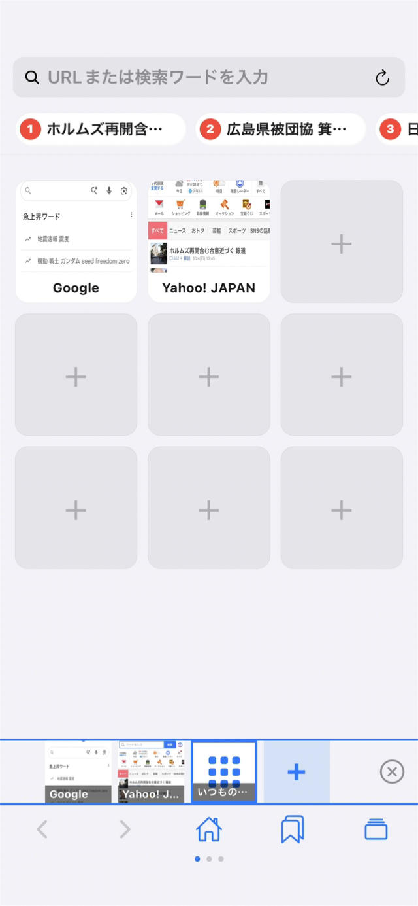
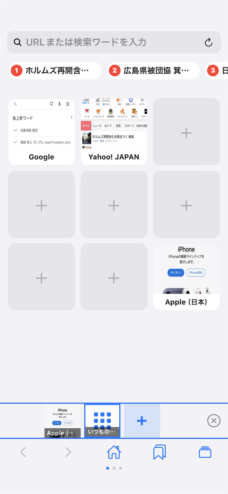
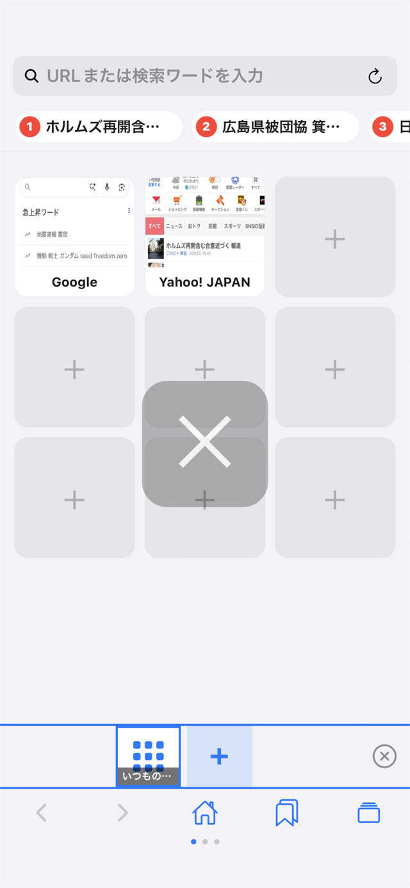
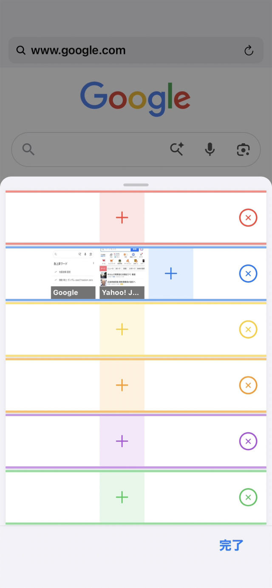
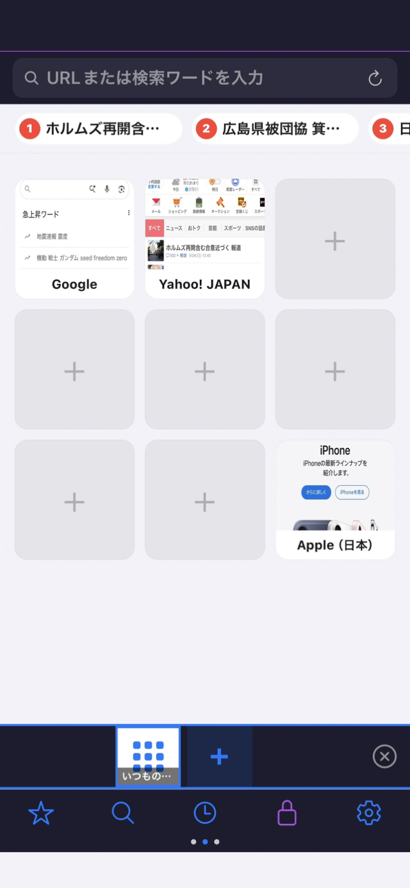
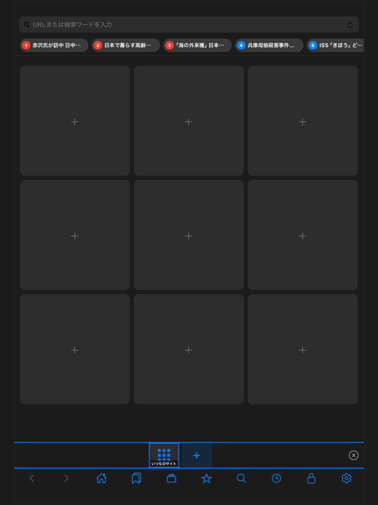
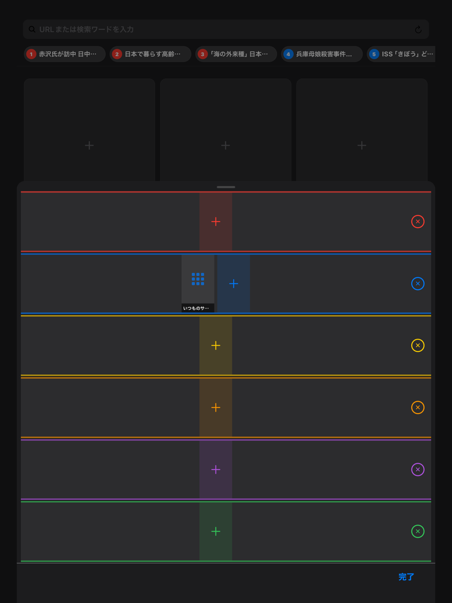

# Bifrost

Bifrost（ビフレスト）は、片手で快適に操作できるジェスチャー中心の iOS 向け Web ブラウザです。

<a class="btn btn-primary" href="https://apps.apple.com/jp/app/id6772665065">App Store からダウンロード</a>

iPhone と iPad に対応（iOS 15.1 以降）。基本機能はすべて無料で使えます。

---

## 主な機能

### ジェスチャー操作

ページの上で指を L 字に動かすだけで、戻る・進む・タブを閉じる・更新ができます。横にスワイプすると隣のタブに切り替わります。ジェスチャーは種類ごとに設定でオン・オフできます。

### タブグループ

赤・青・黄・橙・紫・緑の 6 つのグループにタブを分けて、仕事用と私用などを使い分けられます。グループの画面ではタブをドラッグして別のグループへ移せます。下のタブ一覧でタブをダブルタップするとロックされ、誤って閉じることがなくなります。

### いつものサイト

新しいタブを開くと、よく使うサイトを 9 個まで並べたホーム画面が出ます。サムネイルはサイトを開くたびに自動で更新されます。上部には Yahoo! ニュースの主要トピックスが並びます。起動時にこの画面を開く設定もあります。

### 広告ブロック

AdGuard 互換のフィルタで、広告とトラッキングを自動で止めます。フィルタは週に 1 回自動で更新されます。表示が崩れるサイトは「除外サイト」に登録すると、そのサイトではブロックしません。動画サイトでも広告が流れにくくなっています。

### プライベートモード

履歴や Cookie を端末に残さずに閲覧できます。プライベートモードのタブはメモリ上だけにあり、モードを解除するかアプリを終了すると消えます。何が残って何が残らないかは、アプリ内の「プライベートモードについて」にまとめてあります。

### ダウンロード

ファイルはアプリ内の Downloads フォルダに保存され、iOS の「ファイル」App から開けます。アプリを離れている間も転送は続きます。開始・進行中・完了・失敗は画面上で分かります。

### 検索とページの操作

アドレスバーに入力すると検索候補が出ます。キーボードの上には「アドレスをコピー」と「ペーストして開く」のボタンがあります。ページ内検索は、折りたたまれた部分の中も探せます。戻る・進むボタンを長押しすると、そのタブで開いたページの一覧から選べます。読み直したページは、前に見ていた位置に戻ります。ブックマークはフォルダで整理できます。

### 安全な接続

http:// のサイトは、先に https:// で開けるか試し、開ければそちらを使います。暗号化されていない通信（HTTP）のページでは、アドレスバーに警告を出します。

### カスタマイズ

テーマ（自動 / ライト / ダーク）、タブ一覧の高さ、ホームページ、スクロールバーの表示、各ジェスチャーのオン・オフを設定できます。

### iPad

iPad でも使えます。広い画面に合わせてタブ一覧に多くのタブが並び、サイトはパソコン向けの表示で開きます。

---

## 画面

  <figure style="margin:0;flex:0 0 200px;">
    
    <figcaption style="font-size:0.85em;color:#57606a;">いつものサイト。よく使うサイトをサムネイルで並べる</figcaption>
  </figure>
  <figure style="margin:0;flex:0 0 200px;">
    
    <figcaption style="font-size:0.85em;color:#57606a;">サイトを追加したところ。下のタブ一覧にも並ぶ</figcaption>
  </figure>
  <figure style="margin:0;flex:0 0 200px;">
    
    <figcaption style="font-size:0.85em;color:#57606a;">ジェスチャーでタブを閉じたところ。操作の印が一瞬出る</figcaption>
  </figure>
  <figure style="margin:0;flex:0 0 200px;">
    
    <figcaption style="font-size:0.85em;color:#57606a;">タブグループ。6 色の段にタブを振り分ける</figcaption>
  </figure>
  <figure style="margin:0;flex:0 0 200px;">
    
    <figcaption style="font-size:0.85em;color:#57606a;">プライベートモード。配色が変わる</figcaption>
  </figure>
  <figure style="margin:0;flex:0 0 280px;">
    
    <figcaption style="font-size:0.85em;color:#57606a;">iPad のいつものサイト（ダークテーマ）</figcaption>
  </figure>
  <figure style="margin:0;flex:0 0 280px;">
    
    <figcaption style="font-size:0.85em;color:#57606a;">iPad のタブグループ</figcaption>
  </figure>

---

## Bifrost Pro

アプリ内で Bifrost Pro（買い切り）を購入すると、次の機能が使えます。価格は App Store に表示されます。

- 検索エンジンの選択（Yahoo! JAPAN / Google）
- 同時に保持するタブ数の拡張（8 → 15。タブを切り替えたときの読み直しが減ります）
- いつものサイトのトレンド表示を X のトレンドに切り替え
- Safari などのブラウザから書き出したブックマークの取り込み

基本機能はそのまま無料で使えます。買い直しは不要で、新しい端末や再インストールの後は、設定の「Bifrost Pro」にある「購入を復元」で戻せます（購入したときと同じ Apple アカウントでサインインしている必要があります）。

---

## 最新のアップデート（バージョン 1.10、2026-09-28）

- 戻る / 進むボタンの長押しで、そのタブで開いたページを一覧から選べるようになりました
- ダウンロードの開始、進行中、失敗が画面上で分かるようになりました
- 暗号化されていないサイト（HTTP）を表示で知らせ、HTTPS で開けるサイトは HTTPS で開くようになりました
- ページを読み直したときに、前に見ていた位置へ戻るようになりました
- プライベートモードで残るもの、残らないものの説明を追加しました
- 起動時に「いつものサイト」を開く設定を追加しました
- ページ内検索で、折りたたまれた部分の中も探せるようになりました
- 動画サイトで広告ブロック使用時に画面が黒くなる問題を改善しました
- アプリの更新後に、ダウンロードしたファイルやサムネイルが表示されなくなる問題を修正しました
- 「購入を復元」をすると、Pro の機能が使えなくなることがある問題を修正しました
- 動作の安定性と省電力を改善しました

---

## よくある質問

**Q. ジェスチャーはどう操作しますか？**

A. ページの上で指を L 字に動かします。上に動かしてから右で「戻る」、上から左で「進む」、下から右で「タブを閉じる」、下から左で「更新」です。横にまっすぐ動かすと隣のタブに切り替わります。効かないときは、設定でそのジェスチャーがオンになっているか確かめてください。

**Q. 横スワイプでタブが切り替わらないページがあります。**

A. ページ自体が横スクロールや横スワイプを使っている場所（画像のカルーセル、ニュースのカテゴリ切り替えなど）では、ページの操作を優先してタブは切り替えません。そのときは別の場所でスワイプするか、下のタブ一覧をタップしてください。

**Q. ブックマークや「いつものサイト」のデータは消えますか？**

A. アプリのアップデートでは保持されます。アプリを削除すると端末から消えます。

**Q. 新しい iPhone に買い替えたとき、データは引き継げますか？**

A. ブックマーク、いつものサイト、設定、ダウンロードしたファイルはアプリの中に保存されているので、iOS のバックアップ（iCloud バックアップやクイックスタート）で新しい端末に移ります。アプリ独自の同期機能はありません。

**Q. プライベートモードのデータはどうなりますか？**

A. メモリ上のみで管理され、モード解除またはアプリ終了で全て消えます。ブックマークへの追加やダウンロードしたファイルは、プライベートモード中でも保存されます。

**Q. 広告が消えないサイトや、表示が崩れるサイトがあります。**

A. 広告ブロックはフィルタに載っている配信元を止める仕組みなので、載っていない広告は残ることがあります。表示が崩れるサイトは、設定の「広告ブロック除外サイト」にドメインを登録すると、そのサイトではブロックしません。サブドメインも自動で対象になります。

**Q. ダウンロードしたファイルはどこにありますか？**

A. iOS の「ファイル」App > このiPhone内 > Bifrost > Downloads で閲覧できます。

**Q. 別の端末でも Pro を使えますか？**

A. 購入したときと同じ Apple アカウントなら使えます。新しい端末や再インストールの後は、設定の「Bifrost Pro」にある「購入を復元」を押してください。買い直しは不要です。

**Q. アプリが外部に送る情報はありますか？**

A. 閲覧しているページの内容、履歴、ブックマークを開発者や第三者に送ることはありません。アプリ自身が行う通信は次の 4 つです。

- 検索候補: アドレスバーに入力中の文字を Google に送って候補を取得します
- トレンド: いつものサイトの上部に出す見出しを Yahoo! ニュースから取得します（Pro の X トレンドでは X から）
- サイトのアイコン: ブックマークやタブに出すアイコンを、サイト名を元に Google のアイコン取得サービスから取得します
- 広告ブロックのフィルタ: 週に 1 回、フィルタの一覧を取得します

いずれも、端末やアカウントを特定する情報は付けません。

**Q. 履歴やサイトのデータを消すには？**

A. 閲覧履歴は履歴の画面でまとめて削除できます。Cookie やキャッシュなどサイトのデータは、設定の「Web サイトデータを消去」で消せます（各サイトからログアウトされます）。ログイン状態を保ったままキャッシュだけを消す「キャッシュのみ消去」もあります。

**Q. 不具合を報告するときは、何を伝えればよいですか？**

A. 起きたときの操作と、設定の「診断」にある「診断ログをコピー」の内容を添えてもらえると助かります。診断ログに含まれるのは読み込みの所要時間とサイトのホスト名だけで、ページの内容や入力した文字は含まれません。プライベートモード中のサイト名も記録しません。アプリが自動で送ることはなく、送るかどうかはご自身で決められます。

---

## サポート・お問い合わせ

バグ報告・機能要望・その他のお問い合わせは、下記いずれかの方法でご連絡ください。

- **X (旧 Twitter)**: [@bifrost_apps_x](https://x.com/bifrost_apps_x)
- **メール**: bifrost.apps.support@gmail.com

最新情報や開発状況は X で随時発信しています。

---

## Privacy Policy

Last updated: 2026-05-24

Bifrost (the "App") is a web browser developed for iOS.

### Data Collection

The App does **NOT** collect, store, or transmit any personal data to the developer or any third party. All user data — including
bookmarks, browsing history, downloaded files, settings, and tab states — is stored locally on the device only.

### Web Content

The App allows the user to access third-party websites. The privacy practices of those websites are governed by their own privacy
policies. Bifrost does not transmit any identifying information to those websites beyond what the standard WKWebView engine
provides.

### Children's Privacy

The App does not knowingly collect personal data from anyone, including children under 13.

### Changes

Any changes to this Privacy Policy will be posted on this page.

### Contact

bifrost.apps.support@gmail.com
