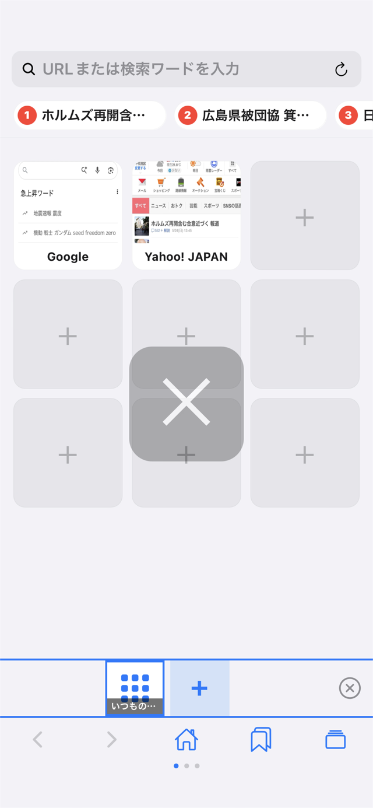
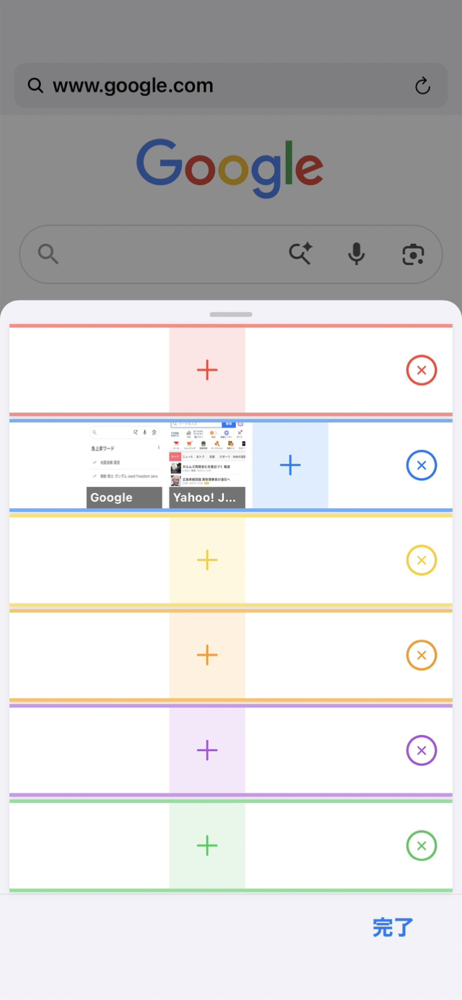
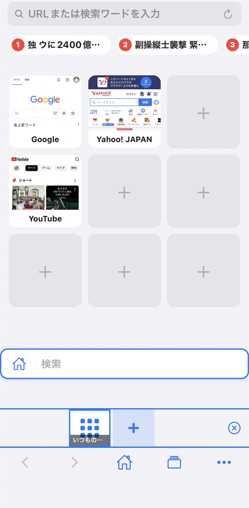
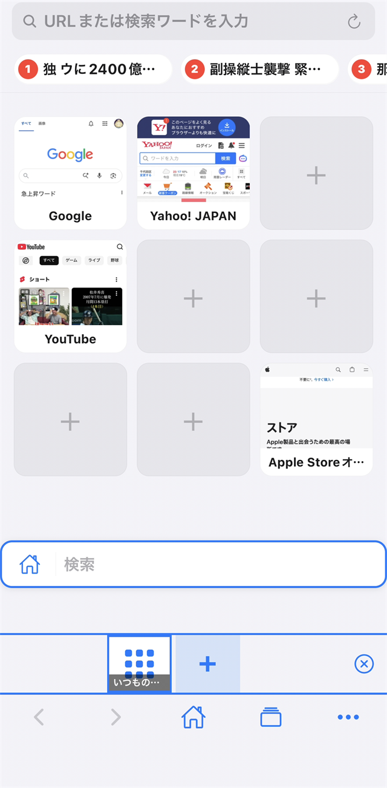
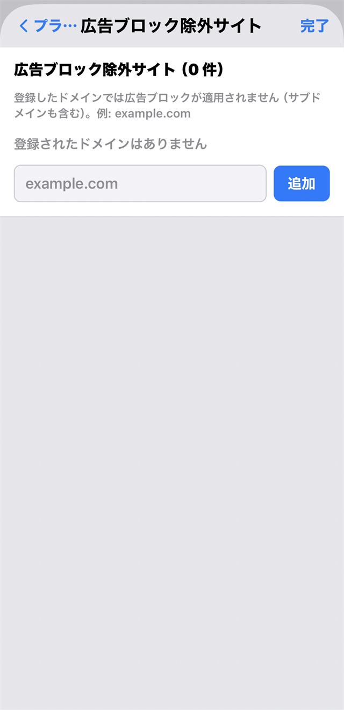
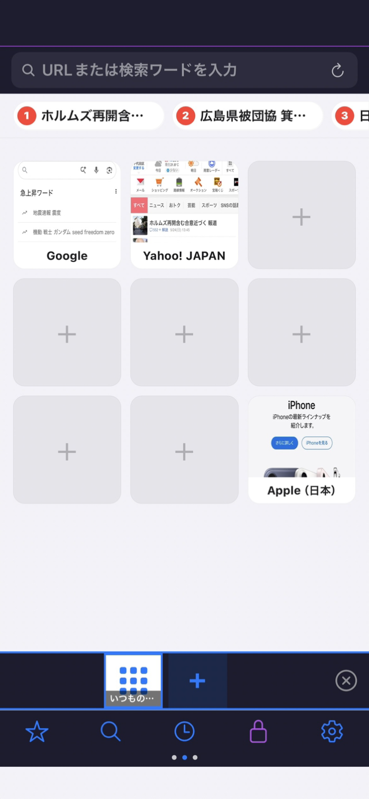
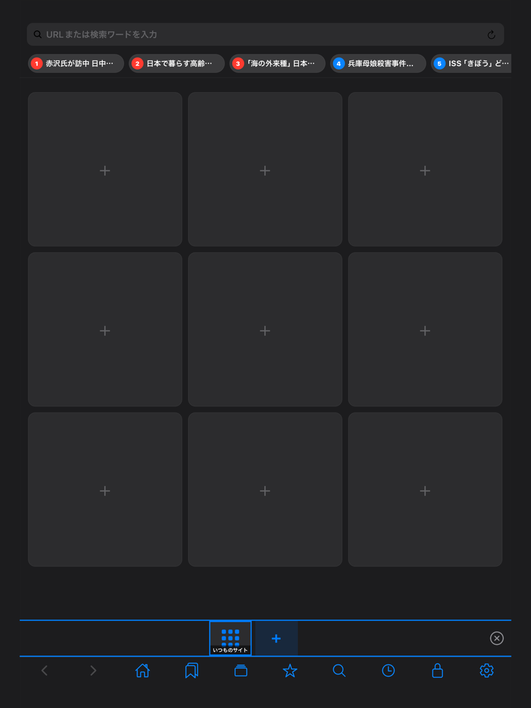
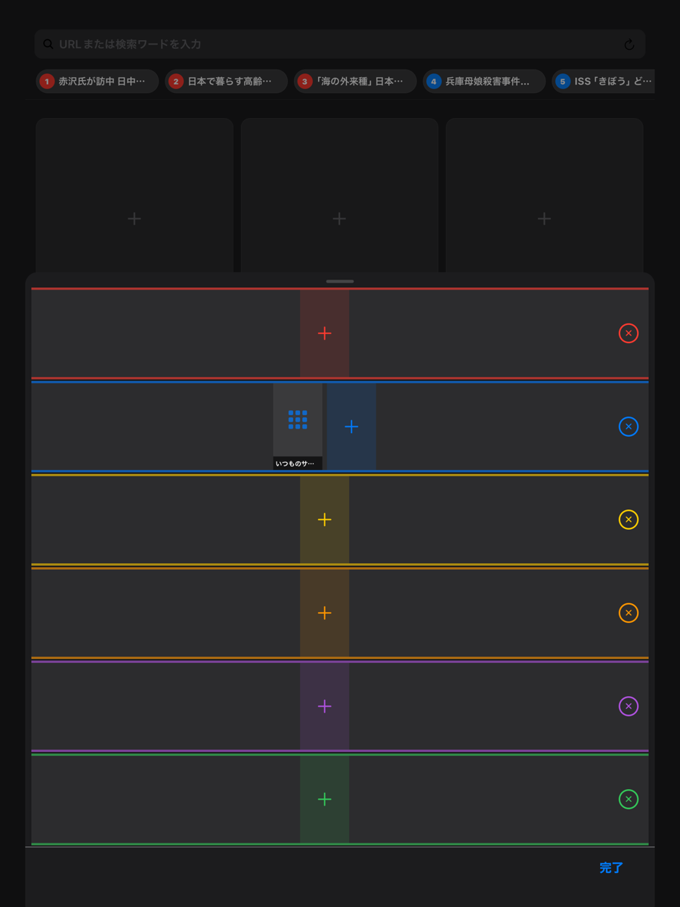

# Bifrost

Bifrost（ビフレスト）は、片手で快適に操作できるジェスチャー中心の iOS 向け Web ブラウザです。

<a href="https://apps.apple.com/jp/app/id6772665065" style="display:inline-block;padding:10px 20px;border-radius:8px;background:#0969da;color:#ffffff;font-weight:600;text-decoration:none;">App Store からダウンロード</a>

iPhone と iPad に対応（iOS 15.1 以降）。基本機能はすべて無料で使えます。

**目次**

- [主な機能](#features)
- [便利な操作](#tips)
- [Bifrost Pro](#pro)
- [最新のアップデート](#updates)
- [よくある質問](#faq)
- [サポート・お問い合わせ](#support)
- [Privacy Policy](#privacy-policy)

---

## 主な機能 {#features}

### ジェスチャー操作

ページの上で指を L 字に動かすだけで、戻る・進む・タブを閉じる・更新ができます。横にスワイプすると隣のタブに切り替わります。画像のカルーセルなど、ページ自体が横スワイプを使う場所でも、画面の左右の端から滑らせればタブが切り替わります。ジェスチャーは種類ごとに設定でオン・オフできます。

<figure style="margin:12px 0 0;">
  
  <figcaption style="font-size:0.85em;color:#57606a;margin-top:4px;">「タブを閉じる」のジェスチャーをしたところ。画面の中央に操作の印が一瞬出る</figcaption>
</figure>

### タブグループ

赤・青・黄・橙・紫・緑の 6 つのグループにタブを分けて、仕事用と私用などを使い分けられます。グループの画面ではタブをドラッグして別のグループへ移せます。下のタブ一覧でタブをダブルタップするとロックされ、下に引いたりジェスチャーをしたりしても閉じなくなります。

<figure style="margin:12px 0 0;">
  
  <figcaption style="font-size:0.85em;color:#57606a;margin-top:4px;">グループの画面。6 色の段にタブを振り分ける</figcaption>
</figure>

### いつものサイト

新しいタブを開くと、よく使うサイトを 9 個まで並べたホーム画面が出ます。サムネイルは、この画面からサイトを開くたびに自動で更新されます。上部には「急上昇ワード」として Yahoo! ニュースの主要トピックスが並びます。起動時にこの画面を開く設定もあります。

  <figure style="margin:0;flex:0 1 220px;">
    
    <figcaption style="font-size:0.85em;color:#57606a;margin-top:4px;">よく使うサイトをサムネイルで並べる</figcaption>
  </figure>
  <figure style="margin:0;flex:0 1 220px;">
    
    <figcaption style="font-size:0.85em;color:#57606a;margin-top:4px;">サイトを追加したところ。ここから開くたびにサムネイルが新しくなる</figcaption>
  </figure>

### 広告ブロック

AdGuard 互換のフィルタで、広告と一部のトラッキングを自動で止めます。フィルタは AdGuard のリスト 4 つ（Base / Japanese / Mobile Ads / Annoyances）と、日本のサイト向けの豆腐フィルタ・もちフィルタの合わせて 6 つを使い、週に 1 回自動で更新されます。パス付きの規則や要素を隠す規則もそのまま使うので、広告だけを精密に止めます。表示が崩れるサイトは「除外サイト」に登録すると、そのサイトではブロックしません。動画サイトでも広告が流れにくくなっています。

<figure style="margin:12px 0 0;">
  
  <figcaption style="font-size:0.85em;color:#57606a;margin-top:4px;">設定の「広告ブロック除外サイト」。ブロックを適用しないサイトをここに登録する</figcaption>
</figure>

### プライベートモード

履歴や Cookie を端末に残さずに閲覧できます。プライベートモードのタブはメモリ上だけにあり、モードを解除するかアプリを終了すると消えます。何が残って何が残らないかは、アプリ内の「プライベートモードについて」にまとめてあります。

<figure style="margin:12px 0 0;">
  
  <figcaption style="font-size:0.85em;color:#57606a;margin-top:4px;">プライベートモード中は配色が変わる</figcaption>
</figure>

### ダウンロード

ファイルはアプリ内の Downloads フォルダに保存され、iOS の「ファイル」App から開けます。アプリを離れている間も転送は続きます。開始・進行中・完了・失敗は画面上で分かります。

### 検索とページの操作

アドレスバーに入力すると検索候補が出ます。キーボードの上には「アドレスをコピー」「ペーストして開く」と QR コードを読み取るボタンがあり、カメラや写真の中の QR コードを読んでそのまま開けます。ページ内検索は、折りたたまれた部分の中も探せます。戻る・進むボタンを長押しすると、そのタブで開いたページの一覧から選べます。読み直したページは、前に見ていた位置に戻ります。ブックマークはフォルダで整理できます。ブックマークや履歴からサイトを開くときは、今見ているページを残して新しいタブで開きます。リンクを長押しすると、今のページを離れずに裏で新しいタブに開き、開いたタブは押した位置からタブ一覧へ飛んで一瞬大きく表示されます。サイトのログインなどで開くポップアップは別の画面で開くので、X などのアカウント連携（ポップアップ方式のログイン）も使えます。「⋯」メニューからは、表示中のページを他のアプリに共有したり、Safari で開き直したりできます。

### 安全な接続

http:// のサイトは、先に https:// で開けるか試し、開ければそちらを使います。暗号化されていない通信（HTTP）のページでは、アドレスバーに警告を出します。

### カスタマイズ

テーマ（自動 / ライト / ダーク）、タブ一覧の高さ、ホームページ、スクロールバーの表示、各ジェスチャーのオン・オフ、ポップアップの開き方を設定できます。設定は「検索とホーム」「表示」「操作」「プライバシーと広告」「詳細」の 5 つのカテゴリに分かれています。

### iPad

iPad でも使えます。広い画面に合わせてタブ一覧に多くのタブが並び、サイトはパソコン向けの表示で開きます。

  <figure style="margin:0;flex:0 1 300px;">
    
    <figcaption style="font-size:0.85em;color:#57606a;margin-top:4px;">iPad のいつものサイト（ダークテーマ）</figcaption>
  </figure>
  <figure style="margin:0;flex:0 1 300px;">
    
    <figcaption style="font-size:0.85em;color:#57606a;margin-top:4px;">iPad のタブグループ</figcaption>
  </figure>

---

## 便利な操作 {#tips}

知っていると便利な操作を、画面の場所ごとにまとめました。

### ページ

- **右端のスクロールバー**: ページをスクロールすると、画面の右端にバーが出ます。バーをつかんで上下に動かすと、長いページでも一気に目的の位置まで移動できます。バーの色は、ページの背景に合わせて濃淡が変わります。設定の「表示」でオフにすると、iOS 標準のスクロールバーになります。ページの中の枠だけがスクロールするサイトでは出ません。
- **画像の長押し**: 「画像を保存」（「写真」に保存）と「画像URLをコピー」が出ます。リンクの付いた画像なら「バックグラウンドで開く」も選べます。
- **ページ内検索**: 「⋯」の「ページ内検索」で、見つかった数と今の位置（例: 3/12）が出ます。上下の矢印で前後の場所へ、キーボードの「検索」キーで次の場所へ移ります。

### 画面下のタブ一覧

- **下に引いて閉じる**: タブを下に引くと灰色の矢印が出て、さらに引くと赤い × に変わります。赤いうちに指を離すと、タブが閉じます。上に戻してから離せば閉じません。
- **ダブルタップでロック**: タブに鍵の印が付きます。ロックしたタブは、下に引いても、ジェスチャーでも、タブ一覧の「すべて閉じる」でも閉じません。もう一度ダブルタップすると解除されます。
- **長押しで別のグループへ**: タブを長押しすると、グループの画面が開きます。指を離さずに動かし、移したい色の段で離すと、そのグループへ移ります。
- **すべて閉じる・新しいタブ**: 左端の丸に × のボタンで、今のグループのタブをまとめて閉じます（ロックしたタブは残ります）。タブの並びの最後にある「＋」で、新しいタブを開きます。
- **一番右のタブからさらに左へ**: サイトを表示している一番右のタブで左へスワイプすると、右隣に新しいタブ（いつものサイト）が開きます。

### タブグループの画面

- 下のボタンの右から 2 番目（重なった四角）で開きます。タブをタップすると、そのグループのそのタブに切り替わります。
- 各段の最後の「＋」で、そのグループに新しいタブを開きます。段の右端の × で、そのグループのタブをすべて閉じます。

### アドレスバー

- タップすると、アドレス全体が選ばれた状態になります。そのまま入力すれば置き換わります。
- サイトを表示しているときにアドレスバーから開くと、今のページを残して新しいタブで開きます。いつものサイトのタブからなら、そのタブで開きます。
- 入力中はページの部分が暗くなり、そこをタップすると入力をやめます。下のタブ一覧とボタンは、入力中も使えます。
- http:// のページでは、アドレスの左にオレンジの警告アイコンが出ます。タップすると、説明と「HTTPS で開き直す」が出ます。

### 下のボタンと「⋯」メニュー

- **戻る・進むの長押し**: そのタブで開いたページの一覧が出て、いくつか前のページへ一度に戻れます。
- **真ん中の家のボタン**: 設定の「ホームページ」に登録したページ（はじめは Yahoo! JAPAN）を開きます。いつものサイトの検索窓の左にある家のアイコンも同じです。
- **「⋯」の印**: ダウンロード中は、青い丸に件数が付きます。終わったダウンロードをまだ見ていないときは、赤い丸が付きます。
- **登録済みのブックマーク**: 登録したページでは、「⋯」の星が塗られて「ブックマーク済」になります。押すと登録を外せます。
- **プライベートモードのお知らせ**: 切り替えた直後に出るお知らせをタップすると、何が残って何が残らないかの説明が開きます。

### いつものサイト

- 空き枠の「＋」をタップすると、登録の画面が開きます。開いているタブや、よく見るページから選べます。タイトルとアドレスを入力して登録することもできます。
- 登録したサイトを長押しすると、「編集」と「削除」が出ます。
- 急上昇ワードをタップすると、その言葉で検索します。

### ブックマークと履歴

- ブックマークを左へスワイプすると「削除」が出ます。長押しすると、別のフォルダへ移せます。フォルダを長押しすると、名前の変更と削除ができます。
- 「編集」では、右端のつまみ（≡）をドラッグして並べ替えられます。項目をタップすると、名前・URL・入れるフォルダを変えられます。
- 履歴は「今日」「昨日」と日付ごとに並びます。上の「消去」で、すべての履歴を削除できます。

### ダウンロード

- 「⋯」の「ダウンロード」の一覧で、完了した行をタップすると共有シートが開き、他のアプリで開いたり保存したりできます。失敗した行やキャンセルした行は、タップでやり直せます。左へスワイプすると削除（ダウンロード中ならキャンセル）です。
- 画面の上に出るお知らせ（開始・完了・失敗）は、タップすると一覧が開き、下へスワイプすると消えます。

---

## Bifrost Pro {#pro}

アプリ内で Bifrost Pro（買い切り）を購入すると、次の機能が使えます。価格は App Store に表示されます。1 回限りの買い切りで、月額などの継続課金はありません。

### 無料版との違い

| 機能 | 無料 | Pro |
|---|---|---|
| 検索エンジン | Yahoo! JAPAN | Yahoo! JAPAN / Google |
| 同時に保持するタブ数 | 8 | 15 |
| 「いつものサイト」のトレンド | Yahoo! | Yahoo! / X |
| ブックマークのインポート（Safari など） | — | ✓ |
| ページ全体を PDF・画像で保存 | — | ✓ |
| 閲覧履歴 | 直近 500 件 | 最大 2 万件。検索できる。保存期間は 3 か月 / 1 年 / 無期限 |
| 動画・音声のバックグラウンド再生とロック画面の操作 | — | ✓ |

広告ブロック・タブグループ・プライベートモード・ジェスチャー操作など、この表にない機能は無料のまま、すべて使えます。

### Pro でできること

**検索とホーム**

- 検索エンジンを Yahoo! JAPAN と Google から選べます（アドレスバーの検索と、いつものサイトの検索窓の両方）。
- いつものサイトの上部に並ぶ見出しを、Yahoo! ニュースの主要トピックスから X のトレンドに切り替えられます。

**タブ**

- 同時に保持するタブ数が 8 から 15 に増えます。タブを切り替えたときの読み直しが減り、入力中のフォームやスクロール位置が残りやすくなります。

**ブックマークと履歴**

- Safari や Chrome、Firefox などから書き出したブックマーク（ZIP または HTML）を取り込めます。トップに並べるか、1 つのフォルダにまとめるかを選べます。
- 閲覧履歴を検索できます。タイトルと URL に対して、空白で区切った語をすべて含むものを探します。全角と半角の違いは気にしなくて構いません。
- 履歴を最大 2 万件まで残せます。保存期間は 3 か月 / 1 年 / 無期限から選べます。無期限でも、2 万件を超えると古いものから消えます（無料版は直近 500 件）。

**ページの保存**

- 表示中のページ全体を、1 枚の縦長の PDF か画像で保存できます。PDF はダウンロード一覧に入り、「ファイル」App からも開けます。画像は写真に保存されます。表示中の画面だけを画像にすることもできます。

**動画**

- ページ内の動画や音声を、画面を消しても、他のアプリに切り替えても再生し続けられます。ロック画面から再生と一時停止ができます。設定の「操作」→「動画」でオフにできます。

### 今後追加予定

次の機能を Pro に追加する予定です。時期や内容は変わることがあります。

- 「いつものサイト」の枠数の拡張
- ブックマーク・履歴のエクスポート
- iCloud バックアップによる多端末同期
- 広告ブロックのカスタムフィルタリストの追加

### 購入の復元

買い直しは不要です。新しい端末や再インストールの後は、設定の「Bifrost Pro」にある「購入を復元」で戻せます（購入したときと同じ Apple アカウントでサインインしている必要があります）。

---

## 最新のアップデート（バージョン 1.13、2026-10-11） {#updates}

すべての方：

- QR コードを読み取って、そのまま Bifrost で開けるようになりました。いつものサイトの検索バーの QR アイコン、またはキーボード上のバーから。写真の中の QR コードも読めます
- 「⋯」メニューに「共有」と「Safari で開く」を追加しました
- 上下にスクロールしたときの慣性が効かなくなっていた問題を直しました
- Yahoo! のトップなど、一部のサイトでジェスチャー（戻る・進む・閉じる・更新）が効かなかった問題を直しました
- いつものサイトとタブのサムネイルが、ページの途中から写ることがあった問題を直しました
- いつものサイトが iPhone SE などの小さい画面で収まりきらなかった問題を直しました
- いつものサイトからの横スワイプが、ゆっくり動かすと切り替わらないことがあった問題を直しました
- 画像付きのリンクを長押しして開いたタブも、文字のリンクと同じく裏で開くようにしました
- タブ一覧の「すべて閉じる」ボタンを左端に移し、タブを下に引いて閉じるときの表示を分かりやすくしました
- キーボード上のバーのボタンを、ダークモードでも読みやすくしました

---

## よくある質問 {#faq}

**Q. ジェスチャーはどう操作しますか？**

A. ページの上で指を L 字に動かします。上に動かしてから右で「戻る」、上から左で「進む」、下から右で「タブを閉じる」、下から左で「更新」です。横にまっすぐ動かすと隣のタブに切り替わります。効かないときは、設定でそのジェスチャーがオンになっているか確かめてください。

**Q. 横スワイプでタブが切り替わらないページがあります。**

A. ページ自体が横スクロールや横スワイプを使っている場所（画像のカルーセル、ニュースのカテゴリ切り替えなど）では、ページの操作を優先してタブは切り替えません。そのときは画面の左右の端から滑らせてください。端から始めたスワイプは、どのサイトでもタブの切り替えになります（バージョン 1.11 以降）。別の場所でスワイプするか、下のタブ一覧をタップしても切り替えられます。

**Q. ログインのときに別の画面が開きます。**

A. サイトがポップアップで開くページ（X などのアカウント連携のログイン画面）は、別の画面で開きます（バージョン 1.11 以降）。多くの場合、ログインが終わると自動で閉じます。閉じないときは右上の「閉じる」を、普通のタブとして見たいときは左上の「タブで開く」を押してください。この動きは、設定の「操作」にある「ポップアップを別画面で開く」でオフにできます。

**Q. ブックマークや「いつものサイト」のデータは消えますか？**

A. アプリのアップデートでは保持されます。アプリを削除すると端末から消えます。

**Q. 新しい iPhone に買い替えたとき、データは引き継げますか？**

A. ブックマーク、いつものサイト、設定、ダウンロードしたファイルはアプリの中に保存されているので、iOS のバックアップ（iCloud バックアップやクイックスタート）で新しい端末に移ります。アプリ独自の同期機能はありません。

**Q. プライベートモードのデータはどうなりますか？**

A. メモリ上のみで管理され、モード解除またはアプリ終了で全て消えます。ただし、ブックマークへの追加、いつものサイトへの登録、ダウンロードしたファイル、「写真」に保存した画像は、プライベートモード中でも保存されます。

**Q. 広告が消えないサイトや、表示が崩れるサイトがあります。**

A. 広告ブロックはフィルタに載っている配信元を止める仕組みなので、載っていない広告は残ることがあります。表示が崩れるサイトは、設定の「広告ブロック除外サイト」にドメインを登録すると、そのサイトではブロックしません。サブドメインも自動で対象になります。

**Q. ダウンロードしたファイルはどこにありますか？**

A. iOS の「ファイル」App > このiPhone内 > Bifrost > Downloads で閲覧できます。

**Q. 別の端末でも Pro を使えますか？**

A. 購入したときと同じ Apple アカウントなら使えます。新しい端末や再インストールの後は、設定の「Bifrost Pro」にある「購入を復元」を押してください。買い直しは不要です。

**Q. アプリが外部に送る情報はありますか？**

A. 閲覧しているページの内容や、履歴・ブックマークの一覧を、開発者や第三者に送ることはありません。開発者はアプリのためのサーバーを持っていません。アプリ自身が行う通信は次の 5 つです。

- 検索候補: アドレスバーと、いつものサイトの検索窓に入力中の文字を Google に送って候補を取得します
- トレンド: いつものサイトの上部に出す見出しを Yahoo! ニュースから取得します（Pro の X トレンドでは X から。バージョン 1.13 までは、X から取れないときにトレンドの一覧サイト getdaytrends.com を読み取ります）
- サイトのアイコン: ブックマーク・履歴・タブなどに出すアイコンを、サイト名（ホスト名）を元に Google のアイコン取得サービスから取得します。そのため、表示したサイトの名前は Google に伝わります
- 広告ブロックのフィルタ: 週に 1 回、フィルタの一覧を配布元（AdGuard と GitHub）から取得します
- 購入の確認: Bifrost Pro の購入状況を、iOS の仕組みを通して App Store に問い合わせます（Apple とのやり取りで、開発者には送られません）

購入の確認を除き、端末やアカウントを特定する情報は付けません。

**Q. 履歴やサイトのデータを消すには？**

A. 閲覧履歴は履歴の画面でまとめて削除できます。Cookie やキャッシュなどサイトのデータは、設定の「Web サイトデータを消去」で消せます（各サイトからログアウトされます）。ログイン状態を保ったままキャッシュだけを消す「キャッシュのみ消去」もあります。

**Q. 不具合を報告するときは、何を伝えればよいですか？**
{: #bug-report}

A. 起きたときの操作と、設定の「診断」にある「診断ログをコピー」の内容を添えてもらえると助かります。診断ログには、読み込みの所要時間とサイトのホスト名のほか、アプリと iOS の版、Cookie の件数、エラーや Pro の購入状況の確認結果などの動作の記録が入ります。ページの本文や入力した文字は含まれません。プライベートモード中のサイト名も記録しません。アプリが自動で送ることはなく、送るかどうかはご自身で決められます。

---

## サポート・お問い合わせ {#support}

バグ報告・機能要望・その他のお問い合わせは、下記いずれかの方法でご連絡ください。

- **X (旧 Twitter)**: [@bifrost_apps_x](https://x.com/bifrost_apps_x)
- **メール**: bifrost.apps.support@gmail.com

最新情報や開発状況は X で随時発信しています。

アプリの設定のトップにある「公式サイト・サポート」と、使い方ガイドの「公式サイト」からも、このページを開けます（バージョン 1.11 以降）。

不具合の報告のしかたは、よくある質問の「[不具合を報告するときは、何を伝えればよいですか？](#bug-report)」をご覧ください。

---

## Privacy Policy

Last updated: 2026-10-12

Bifrost (the "App") is a web browser developed for iOS.

### Data Collection

The App does **NOT** collect personal data. The developer does not operate any server for the App, and none of your data —
including bookmarks, browsing history, downloaded files, settings, and tab states — is sent to the developer. This data is stored
on your device (and in your own iOS backups, such as iCloud Backup, if you use them).

### Third-Party Services

To provide some features, the App itself contacts the following services. Apart from the purchase check, no information that
identifies your device or account is attached.

- **Search suggestions**: the text you are typing in the address bar or in the search box of the home screen is sent to Google
  to fetch suggestions.
- **Site icons**: the host names of sites shown in bookmarks, history, tabs and similar lists are sent to Google's favicon
  service to fetch their icons.
- **Trending topics**: headlines for the home screen are fetched from Yahoo! News (or, for Bifrost Pro users who choose it,
  trends from X). Up to version 1.13, when trends cannot be fetched from X, the App reads a public trend-listing site,
  getdaytrends.com, instead.
- **Ad-block filter lists**: once a week, the filter lists are downloaded from their publishers (AdGuard and GitHub).
- **Purchases**: the status of a Bifrost Pro purchase is checked with the App Store through Apple's StoreKit. This is handled
  by Apple; nothing is sent to the developer.

### Web Content

The App allows the user to access third-party websites. The privacy practices of those websites are governed by their own privacy
policies. Bifrost does not transmit any identifying information to those websites beyond what the standard WKWebView engine
provides.

### Children's Privacy

The App does not knowingly collect personal data from anyone, including children under 13.

### Changes

Any changes to this Privacy Policy will be posted on this page.

### Contact

bifrost.apps.support@gmail.com
