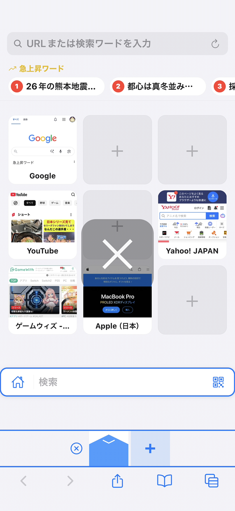
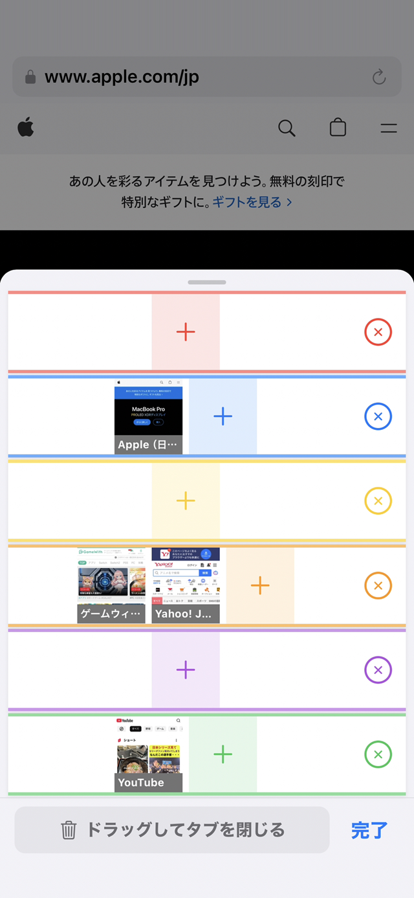
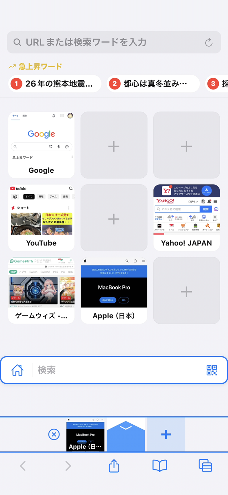
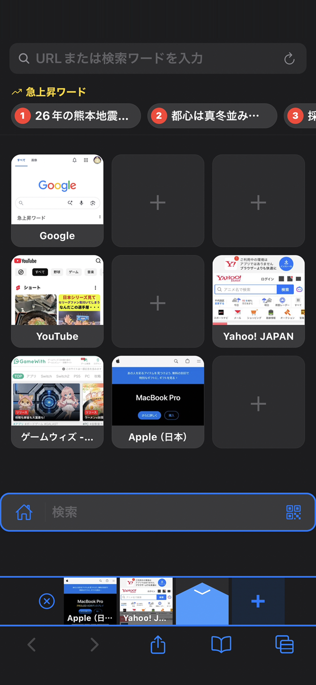
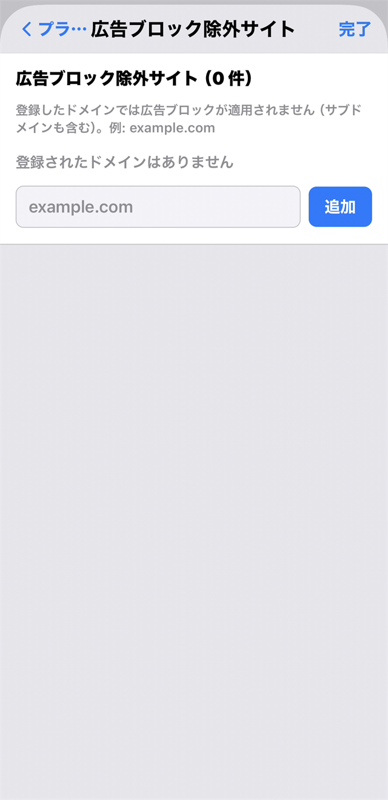
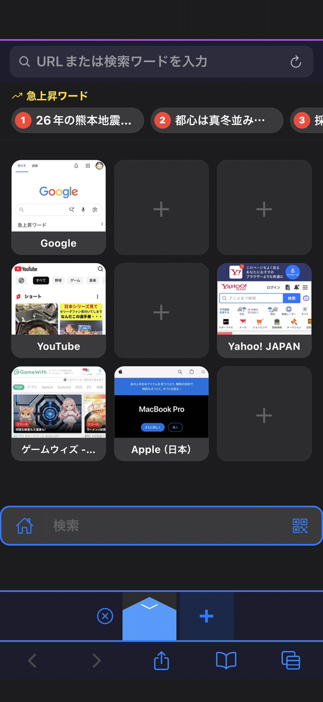
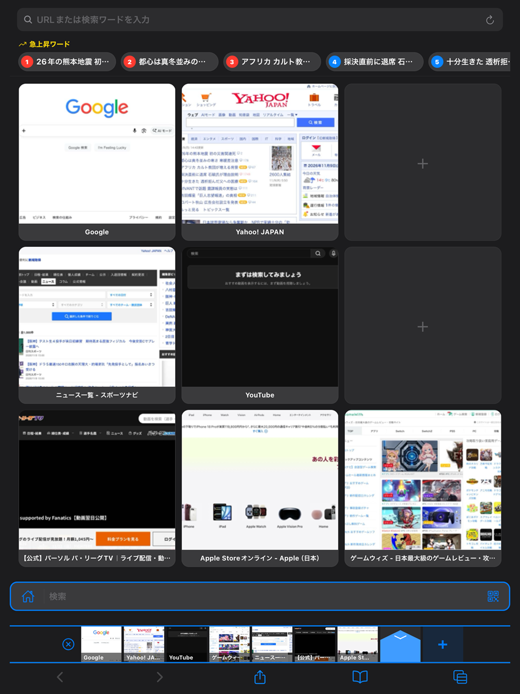
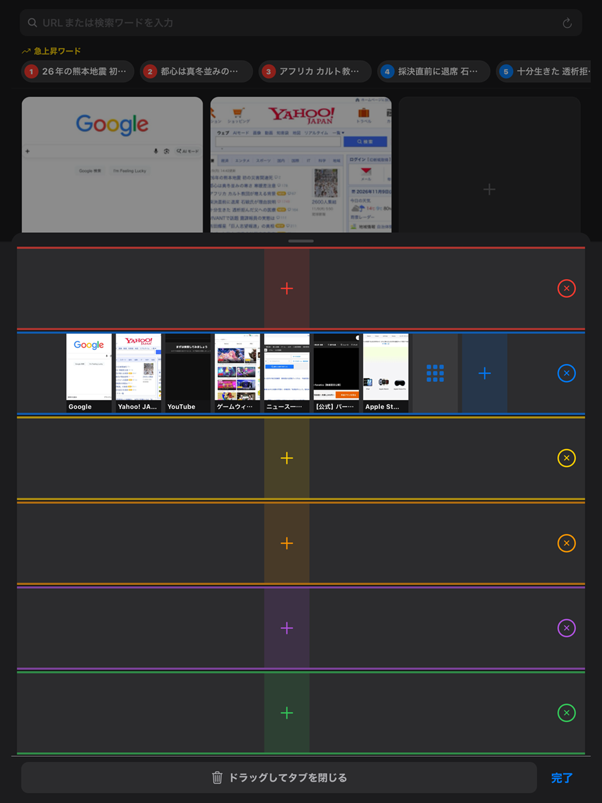

# Bifrost

Bifrost（ビフレスト）は、片手で快適に操作できるジェスチャー中心の iOS 向け Web ブラウザです。

<a href="https://apps.apple.com/jp/app/id6772665065" style="display:inline-block;padding:10px 20px;border-radius:8px;background:#0969da;color:#ffffff;font-weight:600;text-decoration:none;">App Store からダウンロード</a>

iPhone と iPad に対応（iOS 15.1 以降）。基本機能はすべて無料で使えます。

**目次**

- [主な機能](#features)
- [便利な操作](#tips)
- [Bifrost Pro](#pro)
- [最新のアップデート](#updates)
- [よくある質問](#faq)
- [サポート・お問い合わせ](#support)
- [Privacy Policy](#privacy-policy)

---

## 主な機能 {#features}

### ジェスチャー操作

ページの上で指を L 字に動かすだけで、戻る・進む・タブを閉じる・更新ができます。下・右・上の順になぞる（↓→↑）と、最近閉じたタブが 1 つ戻ります。円を 1 回描くと更新、2 回描くと全タブを更新します（表示中のタブグループのタブを順に読み直します）。円は、右回りでも左回りでも、どこから描き始めてもかまいません。形ができた時点で操作の印が出て、指を離すと実行されます。どの形でどの操作をするかは、設定の「操作」の「ジェスチャーの割り当て」で選べます（「なし」にした形は使いません）。「ジェスチャーの感度」を高くすると、L 字・↓→↑・円が、小さな動きや速い動きでも働きます。横にスワイプすると隣のタブに切り替わります。左下から右上へ素早く斜めになぞると全画面になり、右上から左下へなぞると戻ります。画像のカルーセルなど、ページ自体が横スワイプを使う場所でも、画面の左右の端から滑らせればタブが切り替わります。全画面の斜めのなぞりと横スワイプは、設定の「操作」でオフにできます。

<figure style="margin:12px 0 0;">
  
  <figcaption style="font-size:0.85em;color:#57606a;margin-top:4px;">「タブを閉じる」のジェスチャーをしたところ。形ができた時点で操作の印が出て、指を離すと実行される</figcaption>
</figure>

### タブグループ

赤・青・黄・橙・紫・緑の 6 つのグループにタブを分けて、仕事用と私用などを使い分けられます。グループの画面ではタブをドラッグして別のグループへ移せます。「ドラッグしてタブを閉じる」まで運べば、そのタブを閉じられます。グループの画面は、下へスワイプすると閉じます。下のタブ一覧でタブをダブルタップするとロックされ、タブ一覧で閉じる操作をしても、ジェスチャーをしても閉じなくなります。閉じたタブは、下のタブ一覧の最後の「＋」を長押しして出る「最近閉じたタブ」から選ぶと、元のグループの元の位置に戻ります。

<figure style="margin:12px 0 0;">
  
  <figcaption style="font-size:0.85em;color:#57606a;margin-top:4px;">グループの画面。6 色の段にタブを振り分ける</figcaption>
</figure>

### いつものサイト

新しいタブを開くと、よく使うサイトを 9 個まで並べたホーム画面が出ます。長押ししたまま動かすと、並べ替えられます。サムネイルは、この画面からサイトを開くたびに自動で更新されます。上部には「急上昇ワード」として Yahoo! ニュースの主要トピックスが並びます（設定の「検索とホーム」で非表示にもできます）。起動時にこの画面を開く設定もあります。

  <figure style="margin:0;flex:0 1 220px;">
    
    <figcaption style="font-size:0.85em;color:#57606a;margin-top:4px;">よく使うサイトをサムネイルで並べる</figcaption>
  </figure>
  <figure style="margin:0;flex:0 1 220px;">
    
    <figcaption style="font-size:0.85em;color:#57606a;margin-top:4px;">ダークテーマの画面。テーマは設定で、自動・ライト・ダークから選べる</figcaption>
  </figure>

### 広告ブロック

AdGuard 互換のフィルタで、広告と一部のトラッキングを自動で止めます。フィルタは AdGuard のリスト 4 つ（Base / Japanese / Mobile Ads / Annoyances）と、日本のサイト向けの豆腐フィルタ・もちフィルタ、広告ブロックの検知と警告を外す EasyList の Adblock Warning Removal List の合わせて 7 つを使い、週に 1 回自動で更新されます。パス付きの規則や要素を隠す規則もそのまま使うので、広告だけを精密に止めます。広告ブロックを検知してページを止めるサイトにも対策しています。表示が崩れるサイトは「除外サイト」に登録すると、そのサイトではブロックしません。動画サイトでも広告が流れにくくなっています。

<figure style="margin:12px 0 0;">
  
  <figcaption style="font-size:0.85em;color:#57606a;margin-top:4px;">設定の「広告ブロック除外サイト」。ブロックを適用しないサイトをここに登録する</figcaption>
</figure>

### プライベートモード

履歴や Cookie を端末に残さずに閲覧できます。プライベートモードのタブはメモリ上だけにあり、モードを解除するかアプリを終了すると消えます。何が残って何が残らないかは、アプリ内の「プライベートモードについて」にまとめてあります。

<figure style="margin:12px 0 0;">
  
  <figcaption style="font-size:0.85em;color:#57606a;margin-top:4px;">プライベートモード中は配色が変わる</figcaption>
</figure>

### ダウンロード

ファイルはアプリ内の Downloads フォルダに保存され、iOS の「ファイル」App から開けます。アプリを離れている間も転送は続きます。開始・進行中・完了・失敗は画面上で分かります。

### 検索とページの操作

アドレスバーに入力すると検索候補が出ます。キーボードの上には「アドレスをコピー」「ペーストして開く」と QR コードを読み取るボタンがあり、カメラや写真の中の QR コードを読んでそのまま開けます。ページを下へスクロールすると、アドレスバーがドメインだけの細いバーになって下のボタンが隠れ、ページを広く使えます。ページ内検索は、折りたたまれた部分の中も探せます。戻る・進むボタンを長押しすると、そのタブで開いたページの一覧から選べます。読み直したページは、前に見ていた位置に戻ります。ブックマークはフォルダで整理でき、「すべて開く」で、いま見ている階層のブックマークをまとめて裏の新しいタブで開けます。閲覧履歴は、ブックマークの画面の上の「フォルダ」「履歴」の切り替えで見られます。ブックマークや履歴からサイトを開くときは、今見ているページを残して新しいタブで開きます。ブックマークは長押しすると、裏の新しいタブで開きます。リンクを長押しすると、指のそばに輪が出て、輪が閉じると今のページを離れずに裏で新しいタブに開きます。Google・Yahoo!・Bing・DuckDuckGo の検索結果では、長押しして裏で開いたリンクが、元のページの中で訪問済みの色になります。開いたタブは輪の位置からタブ一覧へ飛んで一瞬大きく表示されます。新しいタブは、今のタブのすぐ右に入ります。サイトのログインなどで開くポップアップは別の画面で開くので、X などのアカウント連携（ポップアップ方式のログイン）も使えます。下の真ん中のボタンで開くメニューからは、表示中のページを他のアプリに共有したり、Safari で開き直したりできます。

### 全画面

アドレスバー・タブ一覧・下のボタン・時刻と電池を隠して、ページを画面いっぱいに表示します。下の真ん中のボタンで開くメニューの「全画面」から、または画面のどこでも左下から右上へ素早く斜めになぞると入れます。解除は、右上から左下へなぞるか、画面の一番下の端をタップして出る下のボタンのメニューの「全画面を解除」から。斜めのなぞりは、設定の「操作」でオフにできます。いつものサイトの上では全画面になりません。

### サイトのダーク表示

明るいサイトを、暗い色にして表示します。メニューの「ダーク表示」を押すと、見ているサイトだけが暗くなり、そのサイトが設定の「表示」の「ダークにするサイト」に登録されます（「ダーク解除」で戻ります）。設定では、サイトを指定して登録できるほか、「すべてのサイトを暗くする」をオンにして、暗くしないサイトだけを登録することもできます。もともとダークなサイトは、そのまま表示します。画像と動画は元の色で表示しますが、背景に使われた画像などは色が反転することがあります。プライベートモードでは、サイトごとの切り替えは保存しません。アプリのテーマ（自動 / ライト / ダーク）をライトかダークにすると、ダークに対応したサイトは、サイト自身のダークテーマもそれに合わせて表示します。

### ページ全体の翻訳

見ているページ全体を、端末の言語に翻訳します（iOS 18 以上）。下の真ん中のボタンで開くメニューの「翻訳」を押すと訳され、「原文を表示」を押すと元に戻ります。翻訳は、Apple の翻訳の仕組みを使って、端末の中で行います。初めて使う言語では、iOS が言語データのダウンロードを確かめます。自動では訳さないので、別のページへ移ったときは、もう一度「翻訳」を押してください。プライベートモードでも使えます。訳した表示では、文中のリンクや太字などの書式が見えなくなります（「原文を表示」で戻ります）。とても長いページは、途中まで訳します。iOS 18 より前の iPhone / iPad では、メニューに「翻訳」が出ません。

### 安全な接続

http:// のサイトは、先に https:// で開けるか試し、開ければそちらを使います（ほかのアプリから開いたリンクは、そのままのアドレスで開きます）。暗号化されていない通信（HTTP）のページでは、アドレスバーに警告を出します。

### 既定のブラウザ

Bifrost を既定のブラウザにすると、メールやメッセージなど、ほかのアプリで押したリンクが Bifrost で開きます。既定のブラウザは、iPhone の「設定」アプリで選びます（Bifrost が自動で既定に切り替えることはありません）。アプリの設定のトップにある「既定のブラウザにする」を押すと、選び方の案内と、iPhone の設定を開くボタンが出ます。メニューの「Safari で開く」は、Bifrost を既定にしていても Safari で開きます。

### カスタマイズ

テーマ（自動 / ライト / ダーク）、サイトのダーク表示、タブの高さと幅、ホームページ、新しいタブで開くページ、タブを閉じたあとに開くタブ、急上昇ワードの表示、スクロールバーの表示、下へスクロールしたときにバーを小さくするか、ジェスチャーの割り当てと感度、全画面の斜めのなぞりと横スワイプのオン・オフ、下のタブを閉じる向き、ポップアップの開き方を設定できます。設定は「検索とホーム」「表示」「操作」「プライバシーと広告」「詳細」の 5 つのカテゴリに分かれています。

### iPad

iPad でも使えます。広い画面に合わせてタブ一覧に多くのタブが並び、サイトはパソコン向けの表示で開きます。

  <figure style="margin:0;flex:0 1 300px;">
    
    <figcaption style="font-size:0.85em;color:#57606a;margin-top:4px;">iPad のいつものサイト（ダークテーマ）</figcaption>
  </figure>
  <figure style="margin:0;flex:0 1 300px;">
    
    <figcaption style="font-size:0.85em;color:#57606a;margin-top:4px;">iPad のタブグループ</figcaption>
  </figure>

---

## 便利な操作 {#tips}

知っていると便利な操作を、画面の場所ごとにまとめました。

### ページ

- **下へスクロールでバーを小さく**: ページを下へスクロールして指を離すと、アドレスバーがドメインだけの細いバーになり、下のボタンが隠れます。上へスクロールする・ページの先頭に着く・細いバーをタップする、のどれかで元に戻ります。設定の「表示」の「下へスクロールしたら小さくする」でオフにできます。
- **右端のスクロールバー**: ページをスクロールすると、画面の右端にバーが出ます。バーをつかんで上下に動かすと、長いページでも一気に目的の位置まで移動できます。バーの色は、ページの背景に合わせて濃淡が変わります。設定の「表示」でオフにすると、iOS 標準のスクロールバーになります。ページの中の枠だけがスクロールするサイトでは出ません。
- **リンクの長押し**: 指のそばに青い輪が出て、輪が閉じると裏の新しいタブで開きます。輪が閉じる前に指を離せば開きません。Google・Yahoo!・Bing・DuckDuckGo の検索結果では、開いたリンクが、元のページの中で訪問済みの色になります。
- **画像の長押し**: リンクの付いていない画像なら、「画像を保存」（「写真」に保存）と「画像URLをコピー」が出ます。リンクの付いた画像は、文字のリンクと同じく、長押しで裏の新しいタブに開きます。
- **ページ内検索**: メニューの「ページ内検索」で、見つかった数と今の位置（例: 3/12）が出ます。上下の矢印で前後の場所へ、キーボードの「検索」キーで次の場所へ移ります。

### 画面下のタブ一覧

- **表示中のタブ**: タブグループの色の矢印が付きます。
- **下に引いて閉じる**: タブを下に引くと灰色の矢印が出て、さらに引くと赤い × に変わります。赤いうちに指を離すと、タブが閉じます。上に戻してから離せば閉じません。
- **上に弾いて閉じる**: 設定の「操作」の「下のタブを閉じる向き」を「上に弾く」にすると、タブを上へ動かして閉じます（灰色の矢印が赤い × に変わったところで指を離すと閉じます）。「どちらも」にすると、上下どちらの向きでも閉じます。下に引くと、iPhone の簡易アクセスが画面を下へ動かすことがあります。気になるときは「上に弾く」にするか、iPhone の「設定」アプリ → アクセシビリティ → タッチ → 簡易アクセス をオフにしてください。
- **ダブルタップでロック**: タブの右上の角に、グループの色の三角と白いピンの印が付きます。ロックしたタブは、引いても弾いても、ジェスチャーでも、「すべて閉じる」やグループの画面の × でも閉じません。もう一度ダブルタップすると解除されます。
- **長押しで別のグループへ**: タブを長押しすると、グループの画面が開きます。指を離さずに動かし、移したい色の段で離すと、そのグループへ移ります（「下のタブを閉じる向き」を「上に弾く」か「どちらも」にしているときは、グループの画面が開くまで、指を動かさずに押さえてください）。
- **すべて閉じる・新しいタブ**: タブの並びの左にある丸に × のボタンで、今のグループのタブをまとめて閉じます（ロックしたタブは残ります）。タブの並びの最後にある「＋」で、新しいタブを開きます（開くページは、設定の「検索とホーム」の「新しいタブで開くページ」で、「いつものサイト」か好きなサイトから選べます）。
- **「＋」の長押しで閉じたタブを戻す**: タブの並びの最後にある「＋」を長押しすると、「最近閉じたタブ」の一覧が開きます（新しい順に最大 10 件）。行をタップすると、そのタブが、元のグループの元の位置に、戻る・進むの履歴ごと戻ります（行の左端の色が、元のグループの色です）。下・右・上の順になぞるジェスチャーでも、いちばん新しく閉じたタブが戻ります。一覧はアプリを終了すると空になり、プライベートモードでは閉じたタブを残しません。
- **タブの大きさ**: 設定の「表示」の「タブの高さ」と「タブの幅」で、それぞれ小 / 標準 / 大から選べます。幅を小さくすると、画面にたくさんのタブが並びます。タブグループの画面のタブも、同じ大きさになります。
- **新しいタブの位置**: 新しいタブは、今のタブのすぐ右に入ります。今のタブを表示したまま続けて裏で開いたタブは、開いた順に右へ並びます。
- **一番右のタブからさらに左へ**: サイトを表示している一番右のタブで左へスワイプすると、右隣に新しいタブが開きます（はじめは「いつものサイト」。設定の「検索とホーム」で、好きなサイトにもできます）。

### タブグループの画面

- 下のボタンの一番右（重なった四角）で開きます。タブをタップすると、そのグループのそのタブに切り替わります。下へスワイプするか、「完了」で閉じます。
- 各段の最後の「＋」で、そのグループに新しいタブを開きます。各段の一番左のタブの左隣にある × で、そのグループのタブをすべて閉じます（ロックしたタブは残ります。タブが 1 つも無い段には × は出ません）。
- タブをドラッグして、画面下の「ドラッグしてタブを閉じる」で指を離すと、そのタブを閉じます（ロックしたタブは閉じません）。
- タブの大きさは、画面下のタブ一覧と同じです（設定の「表示」の「タブの高さ」「タブの幅」）。

### アドレスバー

- タップすると、アドレス全体が選ばれた状態になります。そのまま入力すれば置き換わります。
- サイトを表示しているときにアドレスバーから開くと、今のページを残して新しいタブで開きます。いつものサイトのタブからなら、そのタブで開きます。
- 入力中はページの部分が暗くなり、そこをタップすると入力をやめます。下のタブ一覧とボタンは、入力中も使えます。
- http:// のページでは、アドレスの左にオレンジの警告アイコンが出ます。タップすると、説明と「HTTPS で開き直す」が出ます。

### 下のボタンとメニュー

- **ボタンの並び**: 左から、戻る・進む・メニュー（共有の形のアイコン）・ブックマークと履歴（本の形）・タブグループの画面（重なった四角）です。
- **戻る・進むの長押し**: そのタブで開いたページの一覧が出て、いくつか前のページへ一度に戻れます。
- **ホーム**: メニューの「ホーム」で、設定の「ホームページ」に登録したページ（はじめは Yahoo! JAPAN）を開きます。いつものサイトの検索窓の左にある家のアイコンも同じです。
- **全画面**: メニューの「全画面」で、アドレスバー・タブ一覧・下のボタン・時刻と電池が隠れて、ページが画面いっぱいになります。画面のどこでも、左下から右上へ素早く斜めになぞっても入れます（設定の「操作」の「全画面」でオフにできます）。解除は、右上から左下へなぞるか、画面の一番下の端をタップして出る下のボタンのメニューの「全画面を解除」から。いつものサイトの上では全画面になりません。
- **ダーク表示**: メニューの「ダーク表示」で、見ているサイトを暗い色にします。押すと、そのサイトが設定の「表示」の「ダークにするサイト」に登録され、「ダーク解除」で外れます。プライベートモードでは、サイトごとの切り替えは保存しません。
- **翻訳**: iOS 18 以上では、メニューの「翻訳」で、表示中のページ全体を端末の言語に訳します。「原文を表示」で元に戻ります。
- **メニューのボタンの印**: ダウンロード中は、青い丸に件数が付きます。終わったダウンロードをまだ見ていないときは、赤い丸が付きます。
- **登録済みのブックマーク**: 登録したページでは、メニューの星が塗られて「ブックマーク済」になります。押すと登録を外せます。
- **プライベートモードのお知らせ**: 切り替えた直後に出るお知らせをタップすると、何が残って何が残らないかの説明が開きます。

### いつものサイト

- 空き枠の「＋」をタップすると、登録の画面が開きます。開いているタブや、よく見るページから選べます。タイトルとアドレスを入力して登録することもできます。
- 登録したサイトを長押ししたまま動かすと、並べ替えられます。動かさずに離すと、「編集」と「削除」が出ます。
- 急上昇ワードの見出しをタップすると、その記事が開きます。Pro で X のトレンドにしているときは、X の検索結果が開きます。
- 急上昇ワードは、設定の「検索とホーム」の「急上昇ワードを表示」をオフにすると、非表示になります。

### ブックマークと履歴

- 下のボタンの本の形で開きます。上の「フォルダ」「履歴」で、ブックマークと閲覧履歴を切り替えます（バージョン 1.16 から。それまでは、履歴はメニューの「履歴」から開いていました）。フォルダの中でも、下へスワイプすると閉じます（編集中を除く）。
- ブックマークを左へスワイプすると「削除」が出ます。長押しすると、今のページを表示したまま、裏の新しいタブで開きます（一覧は開いたままなので、続けて開けます）。フォルダを長押しすると、名前の変更と削除ができます。
- 下のバーの「すべて開く」で、いま見ている階層のブックマークを、一覧と同じ順に、まとめて裏の新しいタブで開きます（その中のフォルダの中身は開きません。11 件以上のときは、開く前に確かめます）。
- 「編集」では、右端のつまみ（≡）をドラッグして並べ替えられます。項目をタップすると、名前・URL・入れるフォルダを変えられます。
- 履歴は「今日」「昨日」と日付ごとに並びます。左上の「消去」で、すべての履歴を削除できます。履歴の検索は Pro の機能です。
- Pro では、ブックマークのトップの一覧の一番下にある小さな「他のブラウザのブックマークを取り込む」から、Safari・Chrome・Firefox・Edge が書き出したブックマークを取り込めます。

### ダウンロード

- メニューの「ダウンロード」の一覧で、完了した行をタップすると共有シートが開き、他のアプリで開いたり保存したりできます。失敗した行やキャンセルした行は、タップでやり直せます。左へスワイプすると削除（ダウンロード中ならキャンセル）です。
- 画面の上に出るお知らせ（開始・完了・失敗）は、タップすると一覧が開き、下へスワイプすると消えます。

---

## Bifrost Pro {#pro}

アプリ内で Bifrost Pro（買い切り）を購入すると、次の機能が使えます。価格は App Store に表示されます。1 回限りの買い切りで、月額などの継続課金はありません。

### 無料版との違い

| 機能 | 無料 | Pro |
|---|---|---|
| 検索エンジン | Yahoo! JAPAN | Yahoo! JAPAN / Google |
| 同時に保持するタブ数 | 8 | 15 |
| 「いつものサイト」のトレンド | Yahoo! | Yahoo! / X |
| ブックマークのインポート（Safari など） | — | ✓ |
| iCloud 同期（ブックマーク・いつものサイト） | — | ✓ |
| ページ全体を PDF・画像で保存 | — | ✓ |
| 閲覧履歴 | 直近 500 件 | 最大 2 万件。検索できる。保存期間は 3 か月 / 1 年 / 無期限 |
| 動画・音声のバックグラウンド再生とロック画面の操作 | — | ✓ |

広告ブロック・タブグループ・プライベートモード・ジェスチャー操作など、この表にない機能は無料のまま、すべて使えます。

### Pro でできること

**検索とホーム**

- 検索エンジンを Yahoo! JAPAN と Google から選べます（アドレスバーの検索と、いつものサイトの検索窓の両方）。
- いつものサイトの上部に並ぶ見出しを、Yahoo! ニュースの主要トピックスから X のトレンドに切り替えられます。

**タブ**

- 同時に保持するタブ数が 8 から 15 に増えます。タブを切り替えたときの読み直しが減り、入力中のフォームやスクロール位置が残りやすくなります。

**ブックマークと履歴**

- Safari や Chrome、Firefox などから書き出したブックマーク（ZIP または HTML）を取り込めます。トップに並べるか、1 つのフォルダにまとめるかを選べます。設定の「詳細」の「Safari などのブックマークを取り込む」か、ブックマークのトップの一覧の一番下にある「他のブラウザのブックマークを取り込む」から始めます。
- 閲覧履歴を検索できます。タイトルと URL に対して、空白で区切った語をすべて含むものを探します。全角と半角の違いは気にしなくて構いません。
- 履歴を最大 2 万件まで残せます。保存期間は 3 か月 / 1 年 / 無期限から選べます。無期限でも、2 万件を超えると古いものから消えます（無料版は直近 500 件）。

**iCloud 同期**

- ブックマーク（フォルダと並びを含む）と「いつものサイト」を、同じ Apple Account の iPhone / iPad で同期します。設定の「iCloud 同期」でオンにします。iCloud にサインインしている必要があります。
- 同期しないものは、設定・履歴・タブ・Cookie と、「いつものサイト」のサムネイルです。ほかの端末では、そのサイトを開くとサムネイルが撮られ、それまでは仮の表示になります。プライベートモード中に追加・変更したブックマークと「いつものサイト」は、同期されます。
- データは、Apple の iCloud のあなたの個人用の領域にだけ保存されます。開発者のサーバーには送らず、開発者は中身を見られません。
- 同期済みのものを一度にまとめて消したときは、同期を止めて、iCloud にも反映するか、iCloud の内容に戻すかを選んでもらいます。
- オフにしても、この端末と iCloud のデータは残ります。iCloud に保存した分は、設定の「iCloud のデータを削除」で消せます。Pro が切れたときも、同期が止まるだけで、データは残ります。

**ページの保存**

- 表示中のページ全体を、1 枚の縦長の PDF か画像で保存できます。PDF はダウンロード一覧に入り、「ファイル」App からも開けます。画像は写真に保存されます。表示中の画面だけを画像にすることもできます。

**動画**

- ページ内の動画や音声を、画面を消しても、他のアプリに切り替えても再生し続けられます。ロック画面から再生と一時停止ができます。設定の「操作」→「動画」でオフにできます。

### 今後追加予定

次の機能を Pro に追加する予定です。時期や内容は変わることがあります。

- 「いつものサイト」の枠数の拡張
- ブックマーク・履歴のエクスポート
- 広告ブロックのカスタムフィルタリストの追加

### 購入の復元

買い直しは不要です。新しい端末や再インストールの後は、設定の「Bifrost Pro」にある「購入を復元」で戻せます（購入したときと同じ Apple アカウントでサインインしている必要があります）。

---

## 最新のアップデート（バージョン 1.16、2026-11-16） {#updates}

**ご要望にお応えした機能**

- 見ているページ全体を、端末の中で翻訳できるようにしました（iOS 18 以上）。下の真ん中のボタンで開くメニューの「翻訳」で端末の言語に訳し、「原文を表示」で元に戻せます
- ジェスチャーを増やしました。下・右・上の順になぞる（↓→↑）と、最近閉じたタブが 1 つ戻ります。円を 1 回描くと更新、2 回描くと全タブを更新（表示中のタブグループのタブを順に読み直す）です
- ジェスチャーの形ごとに、実行する動作を選べるようにしました（設定の「操作」の「ジェスチャーの割り当て」）。戻る・進む・タブを閉じる・閉じたタブを復元・更新・全タブを更新・なしから選べます。バージョン 1.15 でオフにしていたジェスチャーは、「なし」になります（[よくある質問](#gesture-trouble)）
- 「ジェスチャーの感度」を追加しました（設定の「操作」）。高くすると、小さな動きや速い動きでも、L 字・↓→↑・円のジェスチャーが働きます
- ジェスチャーの形ができた時点で操作の印を出し、指を離すと実行するようにしました。印のデザインも新しくしました
- 下のタブ一覧の「＋」を長押しすると、最近閉じたタブ（最大 10 件）を選んで、元の場所に戻せるようにしました
- ブックマークの画面の下のバーに「すべて開く」を追加しました。いま見ている階層のブックマークを、まとめて裏の新しいタブで開きます
- タブの高さに「大」を加え、タブの幅も小・標準・大から選べるようにしました（設定の「表示」。タブグループの画面のタブも同じ大きさになります）

**既定のブラウザ**

- Bifrost を既定のブラウザにできるようになりました。iPhone の「設定」アプリで選ぶと、メールやメッセージなど、ほかのアプリで押したリンクが Bifrost で開きます。選び方は、設定のトップの「既定のブラウザにする」で案内します
- メニューの「Safari で開く」が、既定のブラウザを Safari 以外にしていても、Safari で開くようにしました

**ブックマーク・履歴**

- 閲覧履歴は、下の真ん中のボタンで開くメニューの「履歴」から、ブックマークの画面の上の「フォルダ」「履歴」の切り替えへ移りました。そのため、メニューでは「プライベートモード」から後ろの項目が 1 つずつ前に詰まりました
- ブックマークのトップの一覧の一番下に、他のブラウザのブックマークを取り込む入口を置きました（取り込みは Pro の機能です）

**タブ・タブグループ**

- 表示中のタブを閉じたあとに、左右どちらの隣のタブを開くかを選べるようにしました（設定の「検索とホーム」の「タブを閉じたあとに開くタブ」。はじめは今までどおり左）
- 下のタブ一覧のタブを、上に弾いて閉じられるようにしました（設定の「操作」の「下のタブを閉じる向き」。はじめは今までどおり下に引いて閉じます）。下に引くと iPhone の簡易アクセスで画面が下へ動いてしまうときにお使いください
- タブグループの画面を、下へスワイプして閉じられるようにしました。グループのタブをまとめて閉じる × は、各段の一番左のタブの左隣に移しました
- 下のタブ一覧で、表示中のタブの矢印をタブグループの色に、ロックしたタブの印を右上の角のピンに、末尾の「＋」を枠の無い形にしました。読み込み中のタブの印も見やすくしました

**そのほか**

- 設定・ダウンロード・使い方ガイド・新機能のお知らせ・ブックマークの追加・サイトの追加の画面を下へスワイプしたとき、指に付いたまま滑らかに閉じるようにしました。「いつものサイト」のサイトの追加画面は、下へスワイプで閉じられるようになりました（入力中の内容は残りません）

**不具合の修正**

次のような問題を直しました。

- ブックマークの一覧を下へスワイプしても閉じない（フォルダの中では、1 つ上の階層へ戻るだけ）
- リンクを長押しして裏のタブで開いたとき、指を離すと、同じリンクが今のページでも開くことがある
- 戻る・進むでページを移ったとき、タブ一覧のサムネイルが、移る前のページのまま変わらないことがある
- タブグループの画面で、タブを自分のすぐ左の位置に落とすと、グループの最後へ移ってしまう
- タブグループの画面で段を横にスクロールしたあと、画面を開き直すと、タブを落とす位置がずれることがある
- ジェスチャーを続けてすると、操作の印が消えずに薄く残ることがある

ご要望や不具合は、設定の「要望・不具合を送る」から匿名で送れます。

App Store の[評価・レビュー](https://apps.apple.com/jp/app/id6772665065?action=write-review)もお待ちしています。

---

## よくある質問 {#faq}

### 操作とジェスチャー

Q. ジェスチャーはどう操作しますか？

A. ページの上で指を L 字に動かします。はじめの設定では、上に動かしてから右で「戻る」、上から左で「進む」、下から右で「タブを閉じる」、下から左で「更新」です。下・右・上の順になぞると「閉じたタブを復元」、円を 1 回描くと「更新」、2 回描くと「全タブを更新」です（円は、右回りでも左回りでも、どこから描き始めてもかまいません）。形ができた時点で操作の印が出て、指を離すと実行されます。形ごとの動作は、設定の「操作」の「ジェスチャーの割り当て」で変えられます。横にまっすぐ動かすと隣のタブに切り替わります。左下から右上へ素早く斜めになぞると全画面になり、右上から左下へなぞると戻ります（設定の「操作」でオフにできます）。

Q. ジェスチャー（円など）が効きません。

A. 設定の「操作」の「ジェスチャーの割り当て」で、その形が「なし」になっていないか確かめてください。バージョン 1.15 の設定で「戻る・進む」「タブを閉じる」「更新」のジェスチャーをオフにしていた場合、バージョン 1.16 では、その動作をする形が「なし」に変わっています（「更新」をオフにしていたなら ↓←・円・円×2、「タブを閉じる」なら ↓→・↓→↑、「戻る・進む」なら ↑→・↑←）。使いたい形の動作を選び直すか、「初期設定に戻す」を押してください。小さな動きや速い動きで働かないときは、「ジェスチャーの感度」を高くしてください。反対に、普通のスクロールで勝手に働くときは、感度を低くするか、その形を「なし」にしてください。いつものサイトの上で働くのは、「タブを閉じる」「閉じたタブを復元」「全タブを更新」の動作だけです。「閉じたタブを復元」は、戻せるタブが無いときは何も起きません。

Q. 横スワイプでタブが切り替わらないページがあります。

A. ページ自体が横スクロールや横スワイプを使っている場所（画像のカルーセル、ニュースのカテゴリ切り替えなど）では、ページの操作を優先してタブは切り替えません。そのときは画面の左右の端から滑らせてください。端から始めたスワイプは、どのサイトでもタブの切り替えになります（バージョン 1.11 以降）。別の場所でスワイプするか、下のタブ一覧をタップしても切り替えられます。

Q. ログインのときに別の画面が開きます。

A. サイトがポップアップで開くページ（X などのアカウント連携のログイン画面）は、別の画面で開きます（バージョン 1.11 以降）。多くの場合、ログインが終わると自動で閉じます。閉じないときは右上の「閉じる」を、普通のタブとして見たいときは左上の「タブで開く」を押してください。この動きは、設定の「操作」にある「ポップアップを別画面で開く」でオフにできます。

### 機能の使い方

Q. Bifrost を既定のブラウザにするには？

A. iPhone の「設定」アプリで、既定のブラウザに Bifrost を選びます（バージョン 1.16 以降）。Bifrost が自動で既定に切り替えることはありません。Bifrost の設定のトップにある「既定のブラウザにする」を押すと、選び方の案内と、iPhone の設定を開くボタンが出ます。最新の iOS では、「設定」→「アプリ」→「デフォルトのアプリ」→「ブラウザアプリ」で選べます（Apple のサポートページ「<a href="https://support.apple.com/ja-jp/121430">iPhoneやiPadでデフォルトのアプリを変更する</a>」）。既定にすると、メールやメッセージなど、ほかのアプリで押したリンクが Bifrost で開きます。Safari などに戻すときも、同じ場所で選び直してください。

Q. ページを翻訳するには？

A. iOS 18 以上の端末で、下の真ん中のボタンで開くメニューの「翻訳」を押します（バージョン 1.16 以降）。表示中のページ全体が端末の言語に訳され、「原文を表示」で元に戻ります。初めて使う言語では、iOS が言語データのダウンロードを確かめます。自動では訳さないので、別のページへ移ったときは、もう一度「翻訳」を押してください。iOS 18 より前の端末では、メニューに「翻訳」が出ません。

Q. 閲覧履歴はどこで見られますか？

A. 下のボタンの本の形でブックマークの画面を開き、上の「フォルダ」「履歴」の切り替えで「履歴」を選びます（バージョン 1.16 で、メニューの「履歴」からここへ移りました）。最後に選んだ側は、アプリを起動している間は覚えています。履歴は「今日」「昨日」と日付ごとに並びます。履歴の検索は Bifrost Pro の機能です。

Q. ダウンロードしたファイルはどこにありますか？

A. iOS の「ファイル」App &gt; このiPhone内 &gt; Bifrost &gt; Downloads で閲覧できます。

### 表示と広告ブロック

Q. 広告が消えないサイトや、表示が崩れるサイトがあります。

A. 広告ブロックはフィルタに載っている配信元を止める仕組みなので、載っていない広告は残ることがあります。表示が崩れるサイトは、設定の「広告ブロック除外サイト」にドメインを登録すると、そのサイトではブロックしません。サブドメインも自動で対象になります。

Q. ダーク表示にしても、暗くならない部分があります。

A. ダーク表示は、サイトの色を反転して暗く見せる機能です。画像と動画は元の色のまま表示しますが、背景に使われた画像などは、色が反転することがあります。うまく表示できないサイトは、メニューの「ダーク解除」で戻してください。もともとダークなサイトは、そのまま表示します。

### データと引き継ぎ

Q. ブックマークや「いつものサイト」のデータは消えますか？

A. アプリのアップデートでは保持されます。アプリを削除すると端末から消えます。Bifrost Pro の iCloud 同期をオンにしていた場合は、iCloud に残り、アプリを入れ直して同期をオンにすると戻ります（「いつものサイト」のサムネイルは、そのサイトを開くと撮り直されます）。

Q. 新しい iPhone に買い替えたとき、データは引き継げますか？

A. ブックマーク、いつものサイト、設定、ダウンロードしたファイルはアプリの中に保存されているので、iOS のバックアップ（iCloud バックアップやクイックスタート）で新しい端末に移ります。Bifrost Pro をお使いなら、設定の「iCloud 同期」で、ブックマークと「いつものサイト」を端末の間で同期することもできます（設定・履歴・ダウンロードしたファイルは同期しません）。

Q. プライベートモードのデータはどうなりますか？

A. メモリ上のみで管理され、モード解除またはアプリ終了で全て消えます。ただし、ブックマークへの追加、いつものサイトへの登録、ダウンロードしたファイル、「写真」に保存した画像は、プライベートモード中でも保存されます。iCloud 同期（Pro）をオンにしていると、ブックマークと「いつものサイト」は、プライベートモード中に追加・変更したものも iCloud で同期されます（タブ・履歴・Cookie は同期しません）。

Q. 履歴やサイトのデータを消すには？

A. 閲覧履歴は、ブックマークの画面の「履歴」の側で、左上の「消去」を押すと、まとめて削除できます。Cookie やキャッシュなどサイトのデータは、設定の「Web サイトデータを消去」で消せます（各サイトからログアウトされます）。ログイン状態を保ったままキャッシュだけを消す「キャッシュのみ消去」もあります。

### Bifrost Pro と iCloud 同期

Q. 別の端末でも Pro を使えますか？

A. 購入したときと同じ Apple アカウントなら使えます。新しい端末や再インストールの後は、設定の「Bifrost Pro」にある「購入を復元」を押してください。買い直しは不要です。

Q. iCloud 同期では、何が同期されますか？

A. Bifrost Pro の機能で、ブックマーク（フォルダと並びを含む）と「いつものサイト」を、同じ Apple Account でサインインした iPhone / iPad の間で同期します。設定の「iCloud 同期」でオンにします（iCloud にサインインしている必要があります）。設定・履歴・タブ・Cookie と、「いつものサイト」のサムネイルは同期しません。プライベートモード中に追加・変更したブックマークと「いつものサイト」は同期されます。データは Apple の iCloud のあなたの個人用の領域にだけ保存され、開発者のサーバーには送らず、開発者は中身を見られません。オフにしても、この端末と iCloud のデータは残ります。iCloud に保存した分は、設定の「iCloud のデータを削除」で消せます。

### プライバシーとサポート

Q. アプリが外部に送る情報はありますか？

A. 閲覧しているページの内容や、履歴・ブックマークの一覧を、開発者や第三者に送ることはありません（Pro の iCloud 同期をオンにしたときに、あなた自身の iCloud に保存する場合を除きます）。開発者はアプリのためのサーバーを持っていません。アプリ自身が行う通信は次の 7 つです。

<ul>
<li>検索候補: アドレスバーと、いつものサイトの検索窓に入力中の文字を Google に送って候補を取得します</li>
<li>トレンド: いつものサイトの上部に出す見出しを Yahoo! ニュースから取得します（Pro の X トレンドでは X から。バージョン 1.13 までは、X から取れないときにトレンドの一覧サイト getdaytrends.com を読み取ります）</li>
<li>サイトのアイコン: ブックマーク・履歴・タブなどに出すアイコンを、サイト名（ホスト名）を元に Google のアイコン取得サービスから取得します。そのため、表示したサイトの名前は Google に伝わります（バージョン 1.14 以降、プライベートモードのタブでは取得しません）</li>
<li>広告ブロックのフィルタ: 週に 1 回、フィルタの一覧を配布元（AdGuard・GitHub・EasyList）から取得します</li>
<li>要望・不具合を送る: 設定と使い方ガイドの「要望・不具合を送る」を開いたときだけ、Google フォームのページを読み込みます。送信を押すと、選んだ種類と書いた内容、書いたときは機種、アプリと iOS の版が Google フォームに送られ、開発者が読みます。名前やメールアドレスは聞かず、診断ログも付けません（バージョン 1.14 以降）</li>
<li>購入の確認: Bifrost Pro の購入状況を、iOS の仕組みを通して App Store に問い合わせます（Apple とのやり取りで、開発者には送られません）</li>
<li>iCloud 同期（Pro）: オンにしたときだけ、ブックマークと「いつものサイト」を、あなたの iCloud（Apple の CloudKit の個人用データベース）に保存し、同じ Apple Account の端末と同期します（Apple とのやり取りで、開発者には送られず、開発者は中身を見られません）</li>
</ul>

購入の確認と iCloud 同期を除き、端末やアカウントを特定する情報は付けません。

ページ全体の翻訳（iOS 18 以上。バージョン 1.16 以降）は、Apple の翻訳の仕組みを使って端末の中で行います。ページの内容をアプリが外部に送ることはありません。初めて使う言語では、iOS が翻訳用の言語データをダウンロードします（確認の画面が出ます）。Apple の文書によると、Apple は翻訳機能の利用状況や性能の統計（アプリのバンドル ID と翻訳元・翻訳先の言語を含む）を集めることがありますが、翻訳する内容は含まれません。

Q. 不具合を報告するときは、何を伝えればよいですか？

A. 起きたときの操作と、設定の「診断」にある「診断ログをコピー」の内容を添えてもらえると助かります。診断ログには、読み込みの所要時間とサイトのホスト名のほか、アプリと iOS の版、Cookie の件数、エラーや Pro の購入状況の確認結果などの動作の記録が入ります。ページの本文や入力した文字は含まれません。プライベートモード中のサイト名も記録しません。アプリが自動で送ることはなく、送るかどうかはご自身で決められます。

---

## サポート・お問い合わせ {#support}

バグ報告・機能要望・その他のお問い合わせは、下記いずれかの方法でご連絡ください。

- **X (旧 Twitter)**: [@bifrost_apps_x](https://x.com/bifrost_apps_x)
- **メール**: bifrost.apps.support@gmail.com
- **アプリから**: 設定のトップと使い方ガイドの「お問い合わせ」にある「要望・不具合を送る」で、匿名のフォームから送れます（バージョン 1.14 以降）。返信が必要なときは、X かメールでご連絡ください

最新情報や開発状況は X で随時発信しています。

App Store の[評価・レビュー](https://apps.apple.com/jp/app/id6772665065?action=write-review)もお待ちしています（iPhone / iPad で開くと、App Store の評価を書く画面に進みます）。

アプリの設定のトップにある「公式サイト・サポート」と、使い方ガイドの「公式サイト」からも、このページを開けます（バージョン 1.11 以降）。

不具合の報告のしかたは、よくある質問の「[不具合を報告するときは、何を伝えればよいですか？](#bug-report)」をご覧ください。

---

## Privacy Policy

Last updated: 2026-11-10

Bifrost (the "App") is a web browser developed for iOS.

### Data Collection

The App does **not** collect personal data automatically. The developer does not operate any server for the App, and none of
your data — including bookmarks, browsing history, downloaded files, settings, and tab states — is sent to the developer. This
data is stored on your device (and in your own iOS backups, such as iCloud Backup, if you use them). If you turn on iCloud Sync (a Bifrost Pro feature, available from version 1.15), your bookmarks (including folders and their order) and Speed Dial (home screen) sites are also stored in your own iCloud account, in a private CloudKit database provided by Apple. That data is available only to you through your Apple Account; the developer cannot read it and does not receive it. History, tabs, settings and Speed Dial thumbnails are not synced. The developer receives only
what you choose to send with the feedback form described below.

### Feedback Form

From version 1.14, "要望・不具合を送る" (Send requests and bug reports) in Settings and in the user guide opens a Google Form in
a Bifrost tab. The App fills in only the App version and the iOS version. Nothing is sent until you press the form's submit
button. The form does not ask for your name, email address or account, and the App does not attach its diagnostic log. What you
submit (the kind of feedback and your message, and, if filled in, your device model and the versions) is stored in Google Forms
and is used only to respond to feedback and to improve the App. Please do not include personal information in your message.
Google Forms is operated by Google under Google's privacy policy.

### Third-Party Services

To provide some features, the App itself contacts the following services. Apart from the purchase check and iCloud Sync, no information that
identifies your device or account is attached.

- **Search suggestions**: the text you are typing in the address bar or in the search box of the home screen is sent to Google
  to fetch suggestions.
- **Site icons**: the host names of sites shown in bookmarks, history, tabs and similar lists are sent to Google's favicon
  service to fetch their icons. From version 1.14, icons are not fetched for tabs in Private Mode.
- **Trending topics**: headlines for the home screen are fetched from Yahoo! News (or, for Bifrost Pro users who choose it,
  trends from X). Up to version 1.13, when trends cannot be fetched from X, the App reads a public trend-listing site,
  getdaytrends.com, instead.
- **Ad-block filter lists**: once a week, the filter lists are downloaded from their publishers (AdGuard, GitHub and EasyList).
- **Feedback form**: when you open "要望・不具合を送る", the form page is loaded from Google, and when you submit it, what you
  entered is sent to Google Forms (see Feedback Form above).
- **Purchases**: the status of a Bifrost Pro purchase is checked with the App Store through Apple's StoreKit. This is handled
  by Apple; nothing is sent to the developer.
- **iCloud Sync (Bifrost Pro)**: when you turn it on, bookmarks and Speed Dial sites are saved to your private iCloud (CloudKit)
  storage and synced to your other devices that use the same Apple Account. This is handled by Apple; nothing is sent to the
  developer.

### Web Content

The App allows the user to access third-party websites. The privacy practices of those websites are governed by their own privacy
policies. Bifrost does not transmit any identifying information to those websites beyond what the standard WKWebView engine
provides.

### Children's Privacy

The App does not knowingly collect personal data from anyone, including children under 13.

### Changes

Any changes to this Privacy Policy will be posted on this page.

### Contact

bifrost.apps.support@gmail.com
